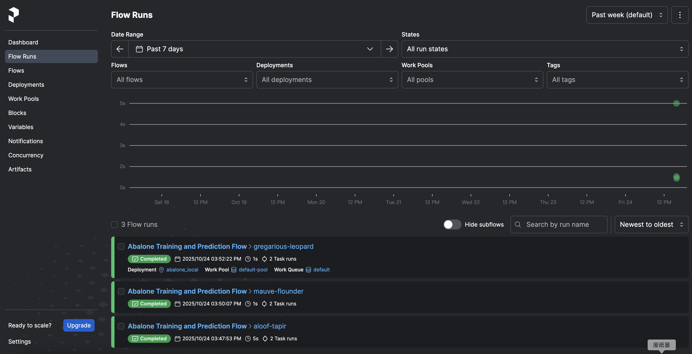
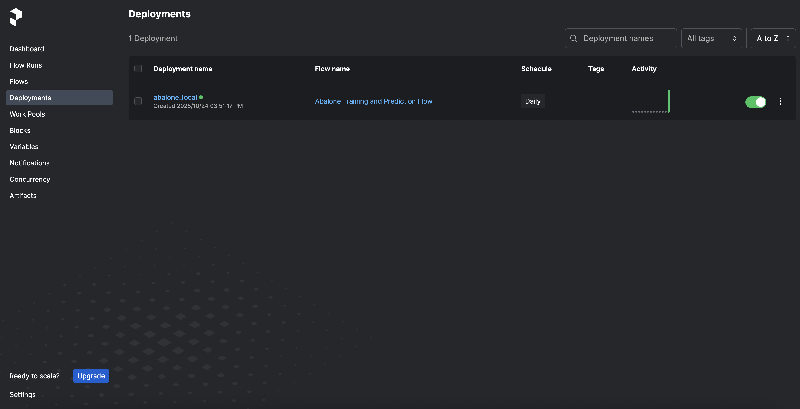
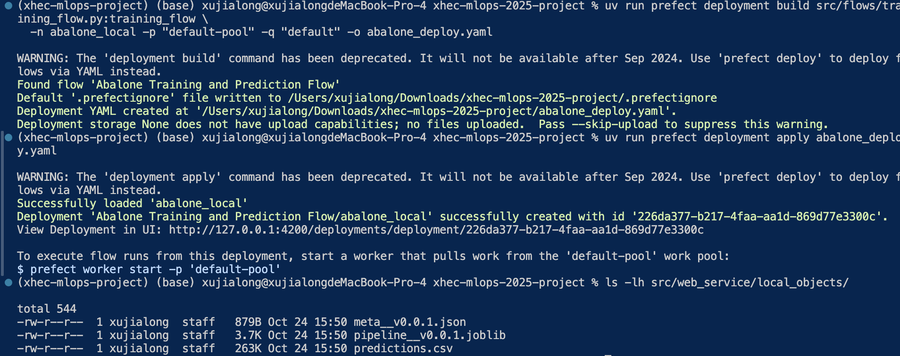
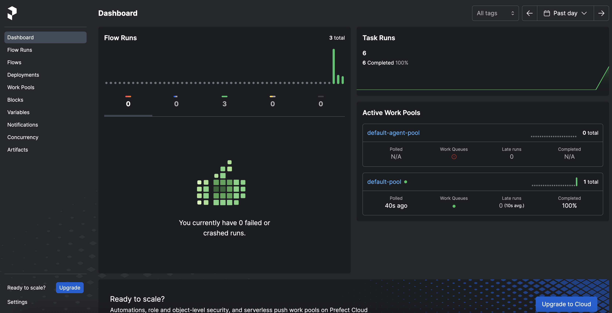
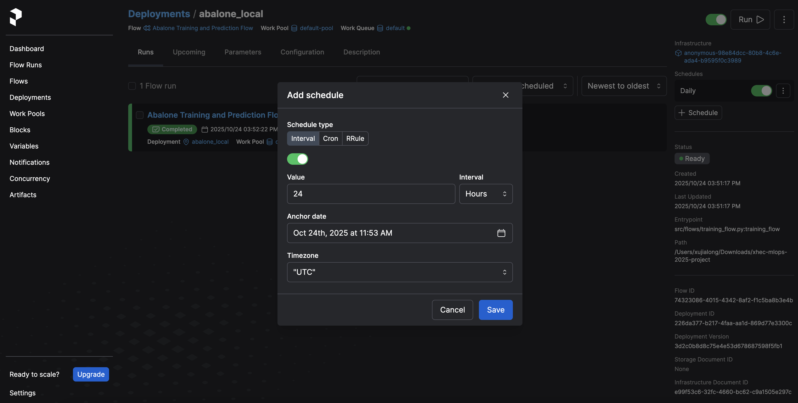

# Prefect Tutorial: Training Flow Deployment Guide

## 🔍 Objective
Build, run, and deploy the **Abalone Training Flow** using Prefect. This document explains how to run Prefect locally, register the deployment, start a worker, and trigger the flow via the Prefect UI.

---

## 🔢 Environment Setup

### 1. Navigate to your project root
```bash
cd ~/Downloads/xhec-mlops-2025-project
```

### 2. Activate virtual environment
```bash
source .venv/bin/activate  # Mac/Linux
# or
.venv\Scripts\activate     # Windows
```

### 3. Set environment variables
```bash
export PREFECT_API_URL="http://127.0.0.1:4200/api"
export PYTHONPATH=$(pwd)
```

---

## 🔧 Step 1: Start Prefect Server (Terminal 1)
Run Prefect UI in the first terminal:
```bash
uv run prefect server start
```
Keep this terminal **open**.

Access the dashboard at:
👉 [http://127.0.0.1:4200](http://127.0.0.1:4200)

---

## 🔄 Step 2: Test Flow Locally (Terminal 2)
Open another terminal and run:
```bash
cd ~/Downloads/xhec-mlops-2025-project
source .venv/bin/activate
export PREFECT_API_URL="http://127.0.0.1:4200/api"
export PYTHONPATH=$(pwd)

uv run python -m src.flows.training_flow
```

Expected output:
```
Flow run 'abalone-training-flow' started
Task 'train_model' succeeded
Flow run completed successfully
```

Check Prefect UI for a successful Flow Run record.

---

## 🔨 Step 3: Register Deployment (Terminal 2)

### 3.1 Create a work pool (only once)
```bash
uv run prefect work-pool create --type process default-pool
```

### 3.2 Build deployment configuration
```bash
uv run prefect deployment build src/flows/training_flow.py:training_flow \
  -n abalone_local -p "default-pool" -q "default" -o abalone_deploy.yaml
```

### 3.3 Apply deployment
```bash
uv run prefect deployment apply abalone_deploy.yaml
```

Check Prefect UI → **Deployments** tab → verify `abalone_local` appears.

---

## 💡 Step 4: Start Worker (Terminal 3)

```bash
cd ~/Downloads/xhec-mlops-2025-project
source .venv/bin/activate
export PREFECT_API_URL="http://127.0.0.1:4200/api"

uv run prefect worker start -p "default-pool" -q "default"
```

Expected output:
```
Worker started, listening on pool 'default-pool', queue 'default'
```

---

## 🔄 Step 5: Trigger Flow from UI
In Prefect UI:
1. Go to **Deployments → abalone_local**
2. Click **Quick Run**
3. Watch Terminal 3 for logs

If successful, Prefect UI should show:
```
Flow run succeeded ✅
```

And new files should appear under:
```
src/web_service/local_objects/
  ├── pipeline__v0.0.1.joblib
  ├── meta__v0.0.1.json
  └── predictions.csv
```

---

## 🕛 Step 6: Schedule Automatic Runs
In the Prefect UI:
- Go to **Deployments → abalone_local**
- Click **Add Schedule**
- Choose type: **Interval → Every 1 day** (Depending on your need)

Prefect will automatically retrain daily.

---

## 📝 Examples

- [x] **Screenshot 1:** Prefect UI showing successful Flow Run  

  

- [x] **Screenshot 2:** Deployments tab showing `abalone_local`  

  

- [x] **Screenshot 3:** Local artifacts generated under `src/web_service/local_objects/`  

  

- [x] **Screenshot 4:** Prefect dashboard overview  

  

- [x] **Screenshot 4:** Automated training pipeline view  

  

---

## ✅ Quick Reference
| Task | Terminal | Command |
|------|-----------|----------|
| Start Prefect UI | 1 | `uv run prefect server start` |
| Run Flow locally | 2 | `uv run python -m src.flows.training_flow` |
| Register Deployment | 2 | `uv run prefect deployment build/apply` |
| Start Worker | 3 | `uv run prefect worker start -p default-pool -q default` |
| Trigger Flow | Browser | Prefect UI → Quick Run |

---

## 🌐 Helpful URLs
- Prefect UI Dashboard: [http://127.0.0.1:4200](http://127.0.0.1:4200)
- Prefect Docs: [https://docs.prefect.io](https://docs.prefect.io)

---

**Author:** Project Group (Jialong Xu et al.)  
**Branch:** `3/use_prefect_fix`  
**Date:** 2025-10

